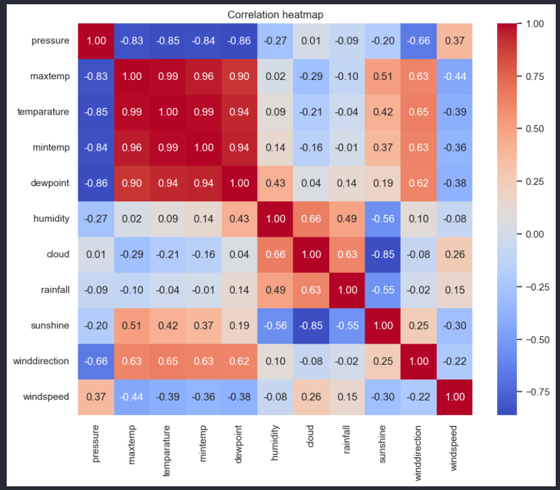
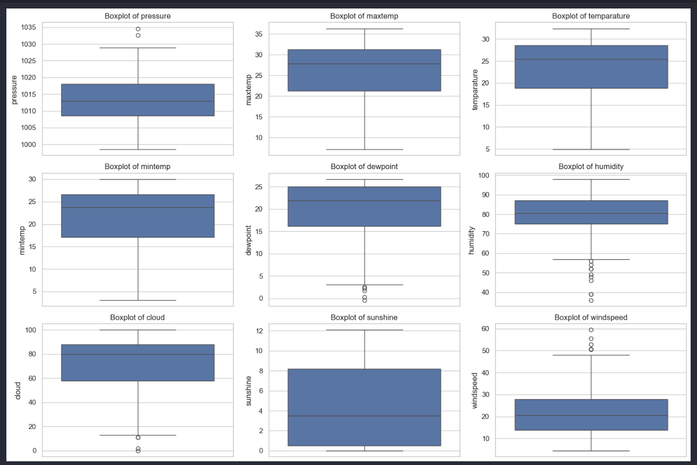
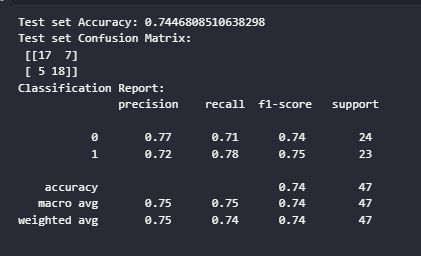

# 🌧️ Rainfall Prediction using Machine Learning

An end-to-end Machine Learning project that predicts rainfall using historical weather data. This project demonstrates data preprocessing, exploratory data analysis (EDA), feature engineering, model training, hyperparameter tuning, and model evaluation using Python and Scikit-learn.

---

## 📌 Project Overview

This project aims to predict whether it will rain based on historical weather observations using Machine Learning techniques.

The workflow includes:

- Data Cleaning
- Exploratory Data Analysis (EDA)
- Feature Engineering
- Model Training
- Hyperparameter Tuning
- Model Evaluation
- Model Saving using Pickle

---

## 🎯 Problem Statement

Rainfall prediction is essential for agriculture, disaster management, and weather forecasting. This project builds a predictive model using historical weather data to classify whether rainfall is likely to occur.

---

## 🛠️ Technologies Used

- Python
- Pandas
- NumPy
- Matplotlib
- Seaborn
- Scikit-learn
- Jupyter Notebook

---

## 📂 Repository Structure

```
Rainfall-Prediction/
│
├── README.md
├── requirements.txt
├── Rainfall.csv
├── Rainfall_Prediction.ipynb
├── rainfall_prediction_model.pkl
├── heatmap.png
├── boxplot.png
└── confusion_matrix.png
```

---

## 📊 Dataset

The dataset contains historical weather information used for rainfall prediction.

Typical features include:

- Temperature
- Humidity
- Pressure
- Wind Speed
- Sunshine
- Cloud Cover
- Rainfall

---

## 📈 Exploratory Data Analysis

The notebook includes:

- Missing Value Analysis
- Statistical Summary
- Correlation Heatmap
- Box Plot Analysis
- Feature Distribution

### Correlation Heatmap



---

### Box Plot



---

## 🤖 Machine Learning Model

**Algorithm Used**

- Random Forest Classifier

---

## ⚙️ Model Training

The project performs:

- Train-Test Split
- Model Training
- Hyperparameter Tuning using GridSearchCV
- Cross Validation

---

## 📊 Model Evaluation

Performance is evaluated using:

- Accuracy Score
- Confusion Matrix
- Classification Report

### Confusion Matrix



---

## 💾 Saved Model

The trained model is stored as:

```
rainfall_prediction_model.pkl
```

This model can be loaded later for predictions without retraining.

---

## 🚀 Installation

Clone the repository

```bash
git clone https://github.com/sanikaautidata/Rainfall-Prediction.git
```

Go to the project folder

```bash
cd Rainfall-Prediction
```

Install dependencies

```bash
pip install -r requirements.txt
```

Launch Jupyter Notebook

```bash
jupyter notebook
```

Open

```
Rainfall_Prediction.ipynb
```

---

## 📌 Project Workflow

1. Import Libraries
2. Load Dataset
3. Data Cleaning
4. Exploratory Data Analysis
5. Data Preprocessing
6. Feature Engineering
7. Train-Test Split
8. Train Random Forest Model
9. Hyperparameter Tuning
10. Evaluate Model
11. Save Model

---

## 💡 Skills Demonstrated

- Data Cleaning
- Exploratory Data Analysis (EDA)
- Data Visualization
- Feature Engineering
- Machine Learning
- Random Forest Classification
- Hyperparameter Tuning
- Cross Validation
- Model Evaluation
- Predictive Analytics
- Python Programming
- Scikit-learn
- Pandas
- NumPy

---

## 👩‍💻 Author

**Sanika Pravin Auti**

Aspiring Data Analyst | Machine Learning Enthusiast

🔗 **LinkedIn:** https://www.linkedin.com/in/sanikaauti736

💻 **GitHub:** https://github.com/sanikaautidata

---

⭐ If you found this project useful, consider giving it a Star.
